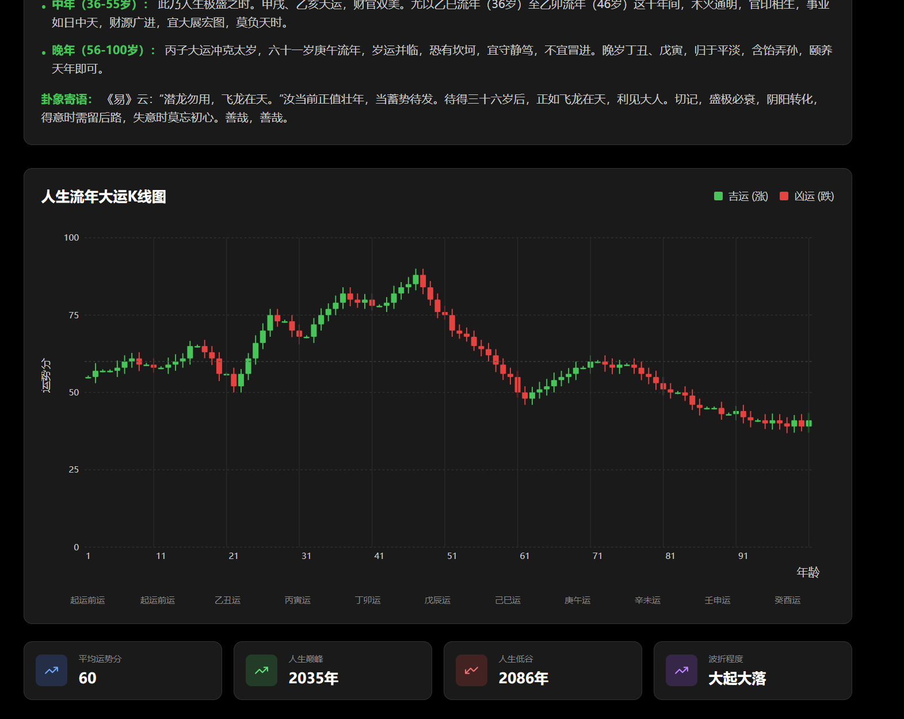

# React + TypeScript + Vite

This template provides a minimal setup to get React working in Vite with HMR and some ESLint rules.

Currently, two official plugins are available:

- [@vitejs/plugin-react](https://github.com/vitejs/vite-plugin-react/blob/main/packages/plugin-react) uses [Babel](https://babeljs.io/) for Fast Refresh
- [@vitejs/plugin-react-swc](https://github.com/vitejs/vite-plugin-react/blob/main/packages/plugin-react-swc) uses [SWC](https://swc.rs/) for Fast Refresh

## Expanding the ESLint configuration

If you are developing a production application, we recommend updating the configuration to enable type-aware lint rules:

```js
export default tseslint.config({
  extends: [
    // Remove ...tseslint.configs.recommended and replace with this
    ...tseslint.configs.recommendedTypeChecked,
    // Alternatively, use this for stricter rules
    ...tseslint.configs.strictTypeChecked,
    // Optionally, add this for stylistic rules
    ...tseslint.configs.stylisticTypeChecked,
  ],
  languageOptions: {
    // other options...
    parserOptions: {
      project: ['./tsconfig.node.json', './tsconfig.app.json'],
      tsconfigRootDir: import.meta.dirname,
    },
  },
})
```

You can also install [eslint-plugin-react-x](https://github.com/Rel1cx/eslint-react/tree/main/packages/plugins/eslint-plugin-react-x) and [eslint-plugin-react-dom](https://github.com/Rel1cx/eslint-react/tree/main/packages/plugins/eslint-plugin-react-dom) for React-specific lint rules:

```js
// eslint.config.js
import reactX from 'eslint-plugin-react-x'
import reactDom from 'eslint-plugin-react-dom'

export default tseslint.config({
  plugins: {
    // Add the react-x and react-dom plugins
    'react-x': reactX,
    'react-dom': reactDom,
  },
  rules: {
    // other rules...
    // Enable its recommended typescript rules
    ...reactX.configs['recommended-typescript'].rules,
    ...reactDom.configs.recommended.rules,
  },
})
```

# 周文王占卜系统

一个现代化的中华传统占卜系统，包含六爻、奇门遁甲、手相等多种占卜方式。

## 功能特性

- 🔮 **六爻占卜**: 传承千年的六爻占卜智慧
- ⭐ **奇门遁甲**: 古代最高层次的预测学
- 👋 **手相分析**: 通过手相读取命运信息
- 📊 **人生K线图**: 基于八字命理的人生运势可视化分析
- 🤖 **AI大师**: 多位虚拟大师提供专业解读
- 📱 **响应式设计**: 支持各种设备访问

## 人生K线图功能

人生K线图是基于传统八字命理，结合现代数据可视化技术，为用户提供100年人生运势的量化分析和可视化展示。



### 功能特点

- 📈 **100年运势分析**: 从出生到100岁，完整的人生运势轨迹
- 🎯 **量化评分系统**: 每5年一个关键节点，0-100分精确评分
- 📊 **K线图表展示**: 直观的K线图展示人生起伏，绿色代表上升，红色代表下降
- 🤖 **AI智能分析**: 结合AI大模型，提供专业的命理分析和建议
- 📋 **详细运势解读**: 包含早年、中年、晚年等不同阶段的详细分析

### 使用方法

1. 进入"人生K线图"页面
2. 输入您的姓名、性别和出生年份
3. 点击"开始分析"按钮
4. 系统将自动生成您的人生K线图和详细分析报告

### 技术实现

- 使用 Recharts 库进行K线图可视化
- 基于八字命理的流年运势计算
- AI大模型生成专业的命理分析
- 数据插值算法生成完整的100年数据

## 摇卦动画设置

六爻占卜页面支持自定义摇卦动画，请按照以下步骤设置：

### 添加摇卦动画视频

1. 将您的摇卦动画视频文件命名为 `divination-animation.mp4`
2. 将文件放置在 `public/` 目录下
3. 确保视频格式为 MP4，时长建议 3-5 秒，支持循环播放

### 推荐的动画内容

- 传统摇卦动作（铜钱摇晃）
- 太极八卦旋转效果
- 古典风格的占卜仪式
- 建议尺寸：正方形比例（如 512x512）

### 临时占位动画

如果没有视频文件，系统会自动显示一个多层旋转的临时动画效果。

## 安装和运行

### 1. 克隆项目并安装依赖

```bash
# 克隆项目
git clone <repository-url>
cd zhouwenwang-divination

# 安装依赖
npm install
```

### 2. 配置 API 密钥（必需）

本应用需要 Gemini API 密钥才能提供 AI 占卜分析功能。您有两种配置方式：

#### 方式一：配置文件预配置（推荐）

1. 获取 Gemini API 密钥：
   - 访问 [Google AI Studio](https://makersuite.google.com/app/apikey)
   - 登录并创建新的 API 密钥

2. 在代码中配置：
   - 打开 `src/masters/config.ts` 文件
   - 找到 `API_CONFIG.GEMINI_API_KEY` 并填入您的密钥：
   ```typescript
   export const API_CONFIG = {
     GEMINI_API_KEY: 'AIzaSyC...您的完整API密钥...', 
   };
   ```

#### 方式二：应用设置页面配置

1. 启动应用后，打开设置页面
2. 在 "API配置" 标签页输入您的 Gemini API 密钥
3. 点击保存

> 💡 **推荐使用方式一**：配置文件预配置更便捷，一次设置永久有效

详细配置说明请查看 [API_CONFIG.md](./API_CONFIG.md)

### 3. 启动应用

```bash
# 启动开发服务器
npm run dev

# 构建生产版本
npm run build
```

## 技术栈

- React 18
- TypeScript
- Tailwind CSS
- Framer Motion
- React Router
- Zustand

## 项目结构

```
src/
├── components/     # 共用组件
├── games/         # 各种占卜游戏
│   ├── liuyao/    # 六爻占卜
│   ├── qimen/     # 奇门遁甲
│   ├── palmistry/ # 手相分析
│   └── lifekline/ # 人生K线图
├── masters/       # AI大师系统
├── core/          # 核心功能
└── pages/         # 页面组件
```

## 开发指南

### 添加新的占卜方式

1. 在 `src/games/` 目录下创建新的占卜类型文件夹
2. 实现占卜逻辑和页面组件
3. 在路由中注册新页面
4. 添加到主导航菜单

### 自定义AI大师

1. 编辑 `public/masters/config.json` 文件
2. 添加新的大师配置信息
3. 实现对应的分析逻辑

## 许可证

MIT License
